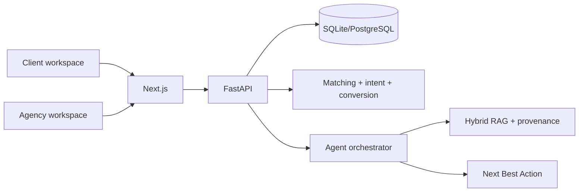

# Property Intelligence

Property Intelligence is a local-first, two-sided property intelligence demo connecting a property seeker with an estate-agency operations team. It turns synthetic applicant behaviour, property records, conversations and feedback into explainable matches, grounded evidence and next-best actions.

> This repository uses synthetic demonstration data and does not contain real customer data.

## What it does

### Client workspace

- Complete a preference profile.
- Receive explainable property matches.
- Save properties, ask grounded property questions, request viewings and submit applications.
- See agency confirmations and application status updates.

### Agency workspace

- Review applicants, properties, demand and operational metrics.
- See persisted viewing requests, applications and client questions.
- Inspect applicant intelligence, intent, conversion signals, matches and next-best actions.
- Search the agency dataset in natural language with citations and source provenance.

## Local demo

Requirements: Python 3.12+, Node 18+, npm, and the repository virtual environment.

```bash
cd property-intelligence
python3 -m venv .venv
./.venv/bin/pip install -r backend/requirements.txt
./.venv/bin/pip install -r backend/requirements-embeddings.txt
make generate seed train index
cd frontend && npm install
```

Start the backend in one terminal:

```bash
cd property-intelligence/backend
../.venv/bin/uvicorn app.main:app --host 0.0.0.0 --port 8000
```

Start the frontend in another:

```bash
cd property-intelligence/frontend
npm run dev -- --hostname 0.0.0.0 --port 3000
```

URLs:

- Product: `http://localhost:3000`
- Client: `http://localhost:3000/client`
- Agency: `http://localhost:3000/agency`
- Agency requests: `http://localhost:3000/agency/requests`
- API health: `http://localhost:8000/health`
- API docs: `http://localhost:8000/docs`

There is no production authentication in this portfolio demo. Landing-page role selection is explicitly demo access: Agency workspace or Sarah Mitchell Client workspace.

## CTO demo flow

1. Open the landing page and enter Client.
2. Complete Sarah’s preferences and open `P-DEMO-01`.
3. Ask `Does this property have good transport?`; inspect the grounded answer.
4. Save the property and request a viewing.
5. Switch to Agency → Requests and confirm the viewing.
6. Open Sarah’s applicant profile and show the persisted activity.
7. Return to Client and show `Viewing confirmed`.
8. Submit an application, update it from Agency, and show the client status.
9. Ask an adversarial question such as `What is Sarah's exact salary?` and demonstrate refusal.
10. Reset the demo with `POST /api/workflow/reset` or the documented reset control when available.

## Architecture



See [the full architecture](docs/ARCHITECTURE.md), including client→agency sequence, RAG, provenance, data model and deployment diagrams.

## RAG

Synthetic database records are converted into property profiles, applicant profiles, conversations, interaction history and viewing feedback. The local index uses `BAAI/bge-base-en-v1.5` embeddings plus TF-IDF lexical retrieval. Query candidates are merged, metadata-filtered, hybrid-scored, reranked and returned as citations. `/api/rag/provenance/{citation_id}` maps a citation back to its source table, source record, original text, generated document, indexed chunk and retrieval scores.

The default answer layer is deterministic and grounded in the returned citations. Unsupported fact questions are qualified/refused rather than invented. Optional local LLM adapters exist, but no paid API is required.

## Evaluation

Run:

```bash
make test
make eval
make rag-provenance
```

The current synthetic evaluation baseline records approximately: RAG Recall@5 `0.4896`, Recall@10 `0.7188`, MRR `0.8264`, NDCG@5 `0.5294`, NDCG@10 `0.6171`, citation coverage `1.0`, groundedness `1.0`, unsupported-claim rate `0.0`. Matching metrics are synthetic-label regression signals and are not production-calibrated business metrics.

## Data and artifacts

`make generate` creates the deterministic synthetic CSV dataset. `make seed` loads it into SQLite/PostgreSQL. `make train` trains local synthetic models. `make index` builds the persistent RAG index. The demo reset restores Sarah’s canonical saved property, confirmed viewing and under-review application state without deleting the base synthetic records.

`exports/property_intelligence_demo_dataset.xlsx` is generated from the database and contains an overview plus Applicants, Properties, Preferences, Conversations, Interactions, Viewings, Feedback, Matches, Applications, Saved Properties and Activity Events sheets.

## Limitations

- Demo role selection is not production authentication.
- Workflow client APIs are scoped to Sarah for the demo; production needs identity-backed authorization.
- Database tables currently use SQLAlchemy startup creation; production needs versioned migrations.
- Model probabilities and evaluation labels are synthetic and not production-calibrated.
- GPU BGE inference is appropriate locally, but free deployment tiers may lack CUDA/RAM; see [deployment plan](docs/DEPLOYMENT_PLAN.md).
