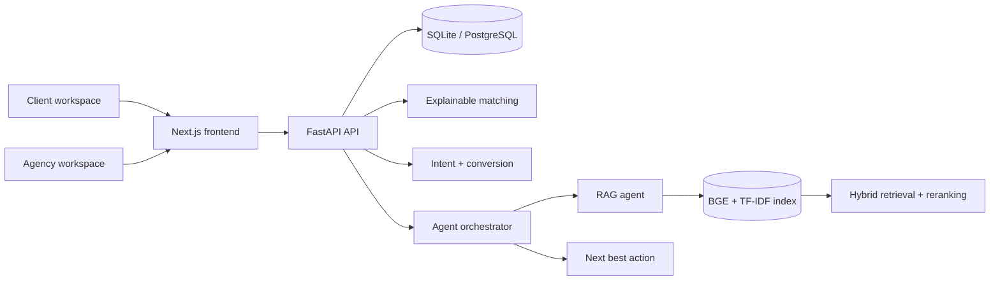
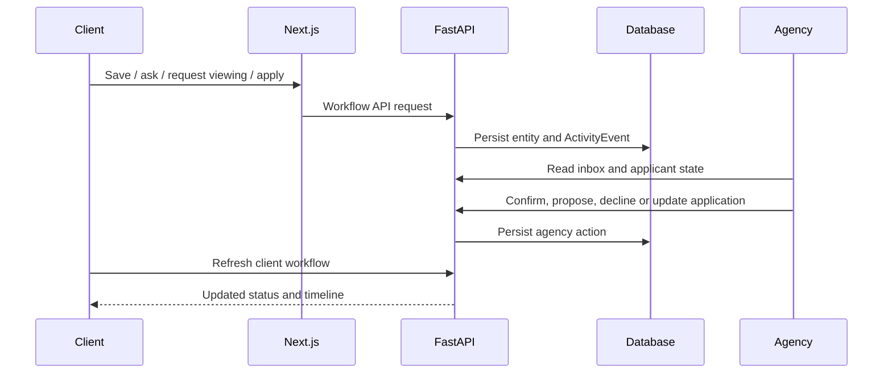
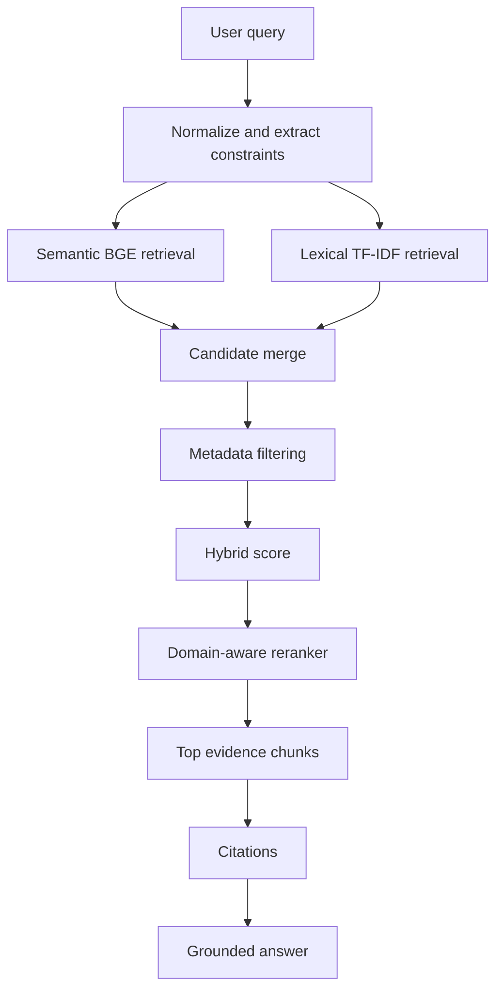
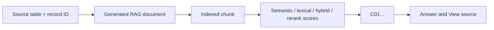
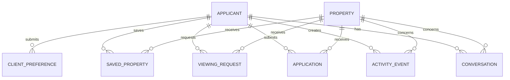
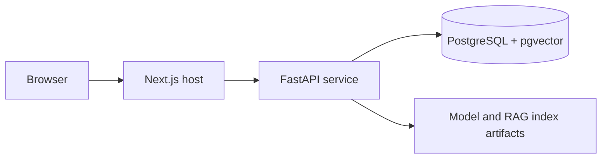

# Architecture

## System architecture

```mermaid
flowchart LR
  Client[Client workspace] --> Next[Next.js frontend]
  Agency[Agency workspace] --> Next
  Next --> API[FastAPI API]
  API --> DB[(SQLite / PostgreSQL)]
  API --> Match[Explainable matching]
  API --> Intent[Intent + conversion]
  API --> Orch[Agent orchestrator]
  Orch --> RAG[RAG agent]
  Orch --> NBA[Next best action]
  RAG --> Index[(BGE + TF-IDF index)]
  Index --> Retrieve[Hybrid retrieval + reranking]
```

## Client-to-agency workflow

```mermaid
sequenceDiagram
  participant C as Client
  participant F as Next.js
  participant A as FastAPI
  participant D as Database
  participant G as Agency
  C->>F: Save / ask / request viewing / apply
  F->>A: Workflow API request
  A->>D: Persist entity and ActivityEvent
  G->>A: Read inbox and applicant state
  G->>A: Confirm, propose, decline or update application
  A->>D: Persist agency action
  C->>A: Refresh client workflow
  A-->>C: Updated status and timeline
```

## RAG pipeline

```mermaid
flowchart TD
  Q[User query] --> N[Normalize and extract constraints]
  N --> S[Semantic BGE retrieval]
  N --> L[Lexical TF-IDF retrieval]
  S --> M[Candidate merge]
  L --> M
  M --> F[Metadata filtering]
  F --> H[Hybrid score]
  H --> R[Domain-aware reranker]
  R --> E[Top evidence chunks]
  E --> C[Citations]
  C --> G[Grounded answer]
```

## Provenance

```mermaid
flowchart LR
  DB[Source table + record ID] --> Doc[Generated RAG document]
  Doc --> Chunk[Indexed chunk]
  Chunk --> Scores[Semantic / lexical / hybrid / rerank scores]
  Scores --> Citation[C01...]
  Citation --> Answer[Answer and View source]
```

## Entity relationships

```mermaid
erDiagram
  APPLICANT ||--o{ CLIENT_PREFERENCE : submits
  APPLICANT ||--o{ SAVED_PROPERTY : saves
  PROPERTY ||--o{ SAVED_PROPERTY : receives
  APPLICANT ||--o{ VIEWING_REQUEST : requests
  PROPERTY ||--o{ VIEWING_REQUEST : receives
  APPLICANT ||--o{ APPLICATION : submits
  PROPERTY ||--o{ APPLICATION : receives
  APPLICANT ||--o{ ACTIVITY_EVENT : creates
  PROPERTY ||--o{ ACTIVITY_EVENT : concerns
  APPLICANT ||--o{ CONVERSATION : has
  PROPERTY ||--o{ CONVERSATION : concerns
```

## Deployment architecture

```mermaid
flowchart LR
  Browser --> Frontend[Next.js host]
  Frontend --> Backend[FastAPI service]
  Backend --> Postgres[(PostgreSQL + pgvector)]
  Backend --> Artifacts[Model and RAG index artifacts]
```
