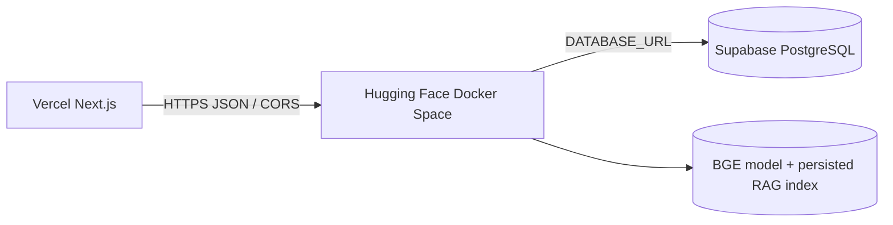

# Deployment Plan

This document describes three intentionally different targets. The local
environment is the reference implementation; the free CTO demo is a
resource-constrained deployment; production requires additional operational
work. No deployment has been performed from this repository.

## Target architecture



### Local

- Next.js runs on `localhost:3000`.
- FastAPI runs on `localhost:8000`.
- SQLite is the default database when `DATABASE_URL` is not supplied.
- The reference semantic index is `models/rag_index.pkl`.
- CUDA is used when available through `EMBEDDING_DEVICE=auto`.

### Free CTO demo

- Vercel hosts the Next.js frontend.
- A Hugging Face Docker Space runs FastAPI on the Space-provided `PORT`,
  defaulting to `7860` in the image.
- Supabase PostgreSQL stores the synthetic source records and persisted demo
  workflow state.
- The image contains the current 6,503-chunk BGE/TF-IDF index and trained
  intent/conversion models. The Docker build also downloads
  `BAAI/bge-base-en-v1.5` and validates 768-dimensional semantic vectors.
- The Space is CPU-configured. It preserves BGE semantic retrieval, but it is
  not equivalent to the local RTX 5090 runtime and will have slower cold
  starts and queries.
- Demo access is role selection, not production authentication.

### Production

Production should use managed PostgreSQL with versioned migrations, real
identity and authorization, persistent model/index storage, a worker-based
serving boundary, observability, backups, secret management, and a GPU or
adequately sized CPU service. The free demo is not a production deployment.

## Repository findings

| Concern | Current implementation | Deployment consequence |
|---|---|---|
| Database | SQLAlchemy supports SQLite and PostgreSQL via `DATABASE_URL` | Set Supabase's SQLAlchemy `postgresql+psycopg://...` URL; do not copy SQLite to the Space |
| Local database | `backend/property_intelligence.db` is SQLite and is gitignored | Local-only state; Supabase must be seeded separately |
| Schema | `Base.metadata.create_all()` runs at startup; no Alembic revision exists | Suitable for a controlled demo bootstrap, not safe schema lifecycle management |
| RAG index | `models/rag_index.pkl` | Filesystem-dependent and must be baked into the immutable image or mounted from persistent storage |
| Embeddings | 6,503 normalized 768-dim BGE vectors are persisted in the pickle | Query-time BGE model is still required; the index alone is not sufficient |
| Lexical index | TF-IDF vectorizer and sparse matrix are in the same pickle | Included in the image; rebuild when source documents change |
| Trained ML | `intent_model.joblib` and `conversion_model.joblib` | Included in the image under `/app/models` |
| Source data | CSVs under `data/processed` | Used to seed Supabase; runtime provenance reads records from PostgreSQL |
| Model cache | Hugging Face model cache is created at image build time | Avoids a first-request download; image builds require outbound access |

## Expected footprint and free-host risks

Measured repository artifacts are approximately:

- `models/rag_index.pkl`: 27 MB.
- Synthetic CSV source data: approximately 5.4 MB.
- SQLite reference database: approximately 11 MB, not used by the demo Space.
- BGE base model plus CPU PyTorch runtime: substantially larger than the
  repository artifacts; exact image size depends on the wheel and cache.

The container requires enough RAM for Python, PyTorch, the BGE model, the
6,503-vector index, TF-IDF matrices, and FastAPI. This repository does not
claim that every current Hugging Face free hardware tier is sufficient. Before
creating the Space, confirm the selected CPU tier's RAM, disk, sleep policy,
build timeout, and outbound model-download limits. If it cannot hold the
image/model, the free CTO target is **not ready** without a larger tier or a
prebuilt image/cache strategy.

## Container contract

The root `Dockerfile` is the Hugging Face Space image. It:

1. Installs the backend requirements plus CPU PyTorch and
   `sentence-transformers`.
2. Copies `backend/app`, scripts, source CSVs, trained models, and
   `models/rag_index.pkl`.
3. Downloads and validates `BAAI/bge-base-en-v1.5` during image creation.
4. Validates that the packaged index contains semantic 768-dimensional
   vectors rather than the hashing fallback.
5. Exposes port `7860` and starts Uvicorn on `${PORT:-7860}`.
6. Provides a `/health` Docker healthcheck.

The existing `backend/Dockerfile` remains the local Compose backend image.
The root image is deliberately separate because Hugging Face builds from the
repository root and must access `models/` and `data/processed/`.

## Environment variables

### Hugging Face Space

Required:

```text
DATABASE_URL=postgresql+psycopg://<user>:<password>@<host>:5432/<database>?sslmode=require
CORS_ORIGINS=https://<your-vercel-project>.vercel.app
ENVIRONMENT=free-demo
DATA_DIR=/app/data/processed
MODEL_DIR=/app/models
EMBEDDING_MODEL=BAAI/bge-base-en-v1.5
EMBEDDING_DEVICE=cpu
EMBEDDING_BATCH_SIZE=32
LLM_PROVIDER=fallback
PORT=7860
```

Operational:

```text
REQUEST_TIMEOUT_SECONDS=8
SEARCH_TIMEOUT_SECONDS=20
RATE_LIMIT_PER_MINUTE=120
```

Optional model-provider variables should remain unset for the local fallback
answer path. Never put `OPENAI_API_KEY` or database credentials in the image,
frontend bundle, Git repository, or Vercel `NEXT_PUBLIC_*` variables.

### Vercel

```text
NEXT_PUBLIC_API_BASE_URL=https://<your-space>.hf.space
INTERNAL_API_BASE_URL=https://<your-space>.hf.space
```

The frontend requires these variables at build/runtime; there is no production
localhost fallback. The checked-in `frontend/.env.example` is only a local
development template and must not be used as a Vercel value.

## Supabase PostgreSQL bootstrap

1. Create a Supabase project and obtain its pooled or direct PostgreSQL URL.
2. Set `DATABASE_URL` locally to that URL.
3. Run `Base.metadata.create_all()` through the existing application startup
   or a controlled bootstrap environment.
4. Generate and load the deterministic synthetic CSV dataset with
   `make generate` and `make seed` against that URL.
5. Run `make train` and `make index` against the same source dataset. The
   resulting `models/rag_index.pkl` must correspond to the records in
   Supabase.
6. Run `make export-dataset` only for the CTO workbook; it is not a database
   migration mechanism.
7. Verify source counts and foreign-key relationships before starting the
   Space.
8. Run the demo reset endpoint once and verify the canonical Sarah state.

There are currently no Alembic revision files. Adding a baseline migration is
required before production; for the controlled synthetic demo, `create_all`
plus a repeatable seed is the current bootstrap path and must be documented
as such.

## Deployment checklist

### Before building the Space

- [ ] Confirm current Hugging Face CPU RAM, disk, build timeout, sleep, and egress limits.
- [ ] Confirm Supabase connection string and SSL mode.
- [ ] Confirm all 11 core tables plus workflow tables are created.
- [ ] Seed only synthetic data; do not use customer data.
- [ ] Build the RAG index from the same seeded dataset.
- [ ] Confirm `embedding_provider=sentence-transformers`, BGE model, and 768 dimensions.
- [ ] Confirm trained joblib files are present.
- [ ] Review `.env.example`; keep secrets in Space/Vercel secret settings.

### Space

- [ ] Create a Docker Space and place the root `Dockerfile` at repository root.
- [ ] Add the Space README metadata with `sdk: docker` and `app_port: 7860`.
- [ ] Set Supabase `DATABASE_URL` as a Space secret.
- [ ] Set exact Vercel origin in `CORS_ORIGINS`.
- [ ] Set `EMBEDDING_DEVICE=cpu` and a conservative batch size.
- [ ] Verify image logs show BGE model/index validation, not hashing fallback.
- [ ] Verify `/health` and `/docs`.
- [ ] Verify cold-start time and first RAG query latency.
- [ ] Verify no SQLite file is being used by inspecting `DATABASE_URL` and logs.

### Vercel

- [ ] Set `NEXT_PUBLIC_API_BASE_URL` to the HTTPS Space URL.
- [ ] Set `INTERNAL_API_BASE_URL` to the HTTPS Space URL for server rendering.
- [ ] Build without exposing secrets in `NEXT_PUBLIC_*` variables.
- [ ] Verify landing, client, agency, search, property and provenance routes.
- [ ] Verify no browser calls still point to localhost.

### Functional acceptance

- [ ] Client questionnaire persists to Supabase.
- [ ] Matching returns real ranked properties and explanations.
- [ ] Client asks a property question and receives grounded RAG evidence.
- [ ] Citation opens provenance and original PostgreSQL source record.
- [ ] Client saves a property and requests a viewing.
- [ ] Agency receives the request in the inbox.
- [ ] Agency confirms/proposes/declines and the client sees the persisted state.
- [ ] Client submits an application and agency updates it.
- [ ] Client sees application status after refresh.
- [ ] Demo reset restores canonical state.

### Security and reliability

- [ ] CORS allows only the deployed frontend origin.
- [ ] HTTPS is used for Vercel, Space and Supabase connections.
- [ ] Demo role selection is labeled as non-authenticated demo access.
- [ ] Client-scoped endpoints remain restricted to the demo client.
- [ ] Rate limiting is enabled with a conservative demo limit.
- [ ] Cold-start and timeout UI states are tested.
- [ ] No API keys, database URLs, or private records are logged.
- [ ] Supabase backups and retention are understood before any non-demo data is used.

## Validation completed locally

Completed:

- Python dependency/import checks for FastAPI, SQLAlchemy, psycopg, PyTorch,
  sentence-transformers and BGE.
- Existing backend tests pass: `6 passed`.
- Existing local CUDA path uses the RTX 5090 and the persisted 6,503-chunk
  semantic index.
- Frontend production build and local API/browser smoke checks pass.
- Docker Engine `29.1.3` is available and the root image builds successfully.
- The built image is approximately `590 MB` before registry compression.
- The rebuilt image starts on port `7860`, reports a healthy database, loads
  CPU BGE, and answers the exact Sarah RAG query with three real citations
  (`C01`/`C-1`, `C02`/`C-5`, `C03`/`C-4`) from a mounted SQLite reference DB.
- The first CPU model load took approximately one minute in the local
  container test; subsequent retrieval completed normally. This is a measured
  cold-start risk for a sleeping free Space.

Not completed on this host:

- `docker compose` runtime: the Compose plugin is unavailable.
- Hugging Face Space build and its actual free-tier RAM/disk/sleep limits.
- Supabase schema/seed against a live project.
- Vercel build with production environment variables.
- Public HTTPS CORS and cross-service workflow verification.

Therefore the free CTO deployment is **container-validated and prepared, but
not deployment-ready** until the Space, Supabase and Vercel checks above are
executed.

## Rollout sequence

1. Provision Supabase and bootstrap synthetic data.
2. Rebuild the index from that exact database dataset.
3. Create the Hugging Face Docker Space and validate the image logs.
4. Test Space `/health`, `/docs`, RAG, citations and provenance directly.
5. Create the Vercel project with both API URL variables.
6. Test the client → agency → client workflow over HTTPS.
7. Record real cold-start, memory and RAG latency measurements.
8. Only then call the free CTO demo ready.
