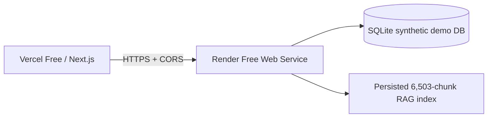

# Free CTO Demo Deployment Plan

Target:



This is a zero-cost CTO demonstration deployment, not production. No Hugging
Face Docker Space, AWS, Azure, paid database, or paid model API is required.

## Runtime decision

The existing local path remains intact:

- `BAAI/bge-base-en-v1.5`.
- CUDA when available.
- Semantic vectors plus TF-IDF lexical retrieval.
- Hybrid scoring, reranking, grounded answers, citations and provenance.

The Render Free process is memory-constrained. A measured isolated CPU BGE
provider reached approximately `1,118 MB` RSS after one query. Therefore the
Render service uses:

```text
RAG_EMBEDDING_MODE=lexical
```

This mode does not import PyTorch or initialize BGE. It still uses the actual
persisted RAG chunks, metadata filters, TF-IDF lexical retrieval, domain-aware
reranking, grounded refusal behavior, citations and provenance. The API
exposes the mode and model state at `/api/rag/status`. Semantic BGE remains
available locally and is not deleted or replaced.

## Repository findings

| Area | Finding | Deployment handling |
|---|---|---|
| Database | Local default is SQLite via `DATABASE_URL` | Render uses `sqlite:///./property_intelligence.db` from the `backend` working directory |
| Dataset | Synthetic CSVs in `data/processed` | Render build seeds the SQLite database from these files |
| RAG index | `models/rag_index.pkl`, 6,503 chunks, 768-dim BGE vectors and TF-IDF matrix | Required artifact; copied from the repository and queried in lexical mode |
| BGE model | Loads lazily only when semantic mode makes a query | Not installed on Render Free; installed by `requirements-embeddings.txt` locally |
| ML artifacts | `intent_model.joblib`, `conversion_model.joblib` | Required files checked during Render build |
| Provenance | Source records are read from SQLite and mapped to indexed chunks | Preserved; citations remain dynamically backed by database records |
| Startup | Schema creation and demo workflow seeding happen at application startup | Build seeds base records; startup also repairs an empty SQLite database |

## Exact Render configuration

The checked-in `render.yaml` describes the service. In the Render dashboard,
create a **Web Service**, select the repository, choose the **Free** plan, and
use these commands if dashboard configuration is required.

### Build command

```bash
pip install -r backend/requirements-render.txt && cd backend && python scripts/seed_database.py && test -f ../models/rag_index.pkl && test -f ../models/intent_model.joblib && test -f ../models/conversion_model.joblib
```

### Start command

```bash
cd backend && python -c "from app.db.session import SessionLocal; from app.db.models import Applicant, Property; from sqlalchemy import func, select; db=SessionLocal(); empty=(db.scalar(select(func.count()).select_from(Applicant)) or 0)==0 or (db.scalar(select(func.count()).select_from(Property)) or 0)==0; db.close(); raise SystemExit(1 if empty else 0)" || python scripts/seed_database.py; exec uvicorn app.main:app --host 0.0.0.0 --port $PORT --workers 1
```

### Render environment variables

```text
DATABASE_URL=sqlite:///./property_intelligence.db
CORS_ORIGINS=https://property-intelligence-pearl.vercel.app
ENVIRONMENT=render-free-demo
MODEL_DIR=../models
DATA_DIR=../data/processed
RAG_EMBEDDING_MODE=lexical
EMBEDDING_DEVICE=cpu
EMBEDDING_BATCH_SIZE=16
LLM_PROVIDER=fallback
RATE_LIMIT_PER_MINUTE=120
```

Do not set an `OPENAI_API_KEY`, database password, or other secret in this
demo. The fallback answer layer is local and grounded in retrieved evidence.

## Exact Vercel configuration

Create a Next.js project from the repository's `frontend` directory.

```text
Root Directory: frontend
Framework: Next.js
Build Command: npm run build
Install Command: npm ci
```

Set:

```text
NEXT_PUBLIC_API_BASE_URL=https://<your-render-service>.onrender.com
INTERNAL_API_BASE_URL=https://<your-render-service>.onrender.com
```

The frontend has no production localhost fallback. `frontend/.env.example` is
only for local development.

## Deployment sequence

1. Confirm `models/rag_index.pkl`, `models/intent_model.joblib`,
   `models/conversion_model.joblib`, and `data/processed/*.csv` are committed
   to the deployment repository.
2. Create the Render service from `render.yaml` or configure the commands above.
3. Set the exact Vercel origin in `CORS_ORIGINS`; the checked-in blueprint
   sets `https://property-intelligence-pearl.vercel.app`.
4. Deploy Render and wait for the build seed to complete.
5. Verify `https://<render>/health` and `https://<render>/docs`.
6. Verify `https://<render>/api/rag/status` reports `loaded: false`,
   `configured_mode: lexical`, and `index.chunks: 6503`.
7. Run a normal search and a RAG query.
8. Open a returned citation through `/api/rag/provenance/{citation_id}`.
9. Verify adversarial questions refuse unsupported claims.
10. Deploy Vercel with both API URL variables.
11. Verify browser CORS, client questionnaire, matching, property questions,
    save/viewing/application workflow, agency inbox, status updates and reset.

## SQLite suitability

SQLite is acceptable for this **synthetic, low-traffic CTO demo** because the
database can be recreated deterministically during the Render build. It is not
durable shared production storage. Render service replacement/redeploy can
discard workflow changes, and a single instance is required for consistent
demo state. Do not use this configuration for customer data or production
operations.

## Runtime behavior and memory

Measured local Render-mode process:

- Startup RSS: approximately `181 MB`.
- After `/api/rag/status`: approximately `186 MB`; BGE remained unloaded.
- After a real RAG/search query: approximately `218 MB`.
- Semantic model state: `loaded=false`.
- RAG query: returned three real citations with grounded output.

Measured local semantic CPU comparison:

- PyTorch import alone was approximately `602 MB` in the test process.
- BGE provider load reached approximately `780 MB`.
- After one embedding query: approximately `1,118 MB`.

These are local measurements, not guarantees of Render's accounting. The
lexical mode is the required 512 MB safety strategy. Render cold starts and
free-tier sleep behavior still need live verification.

## Diagnostics and acceptance

```bash
curl https://<render>/health
curl https://<render>/api/rag/status
curl -X POST https://<render>/api/search \
  -H 'content-type: application/json' \
  -d '{"query":"Why is Sarah a strong candidate for P-DEMO-01?","applicant_id":"A-DEMO-SARAH","property_id":"P-DEMO-01","limit":3}'
```

Acceptance requires:

- `/health` remains lightweight and does not load BGE.
- `/api/rag/status` reports model state without initializing BGE.
- Search returns actual citations and `generation.grounded=true`.
- Provenance resolves the source record, RAG chunk and retrieval metadata.
- Tesla/salary/school/dog adversarial questions are refused.
- Vercel browser requests contain no localhost URL.
- Client → agency → client workflow survives refresh during one live instance.

## Known limitations

- Render Free mode is lexical rather than BGE semantic because measured BGE
  memory exceeds the 512 MB limit.
- SQLite workflow state is not durable across service replacement/redeploy.
- Demo role selection is not authentication.
- No versioned Alembic baseline exists yet.
- One free web instance is not a production concurrency architecture.
- Public Render/Vercel CORS and cold-start behavior are not verified until the
  services are actually provisioned.
